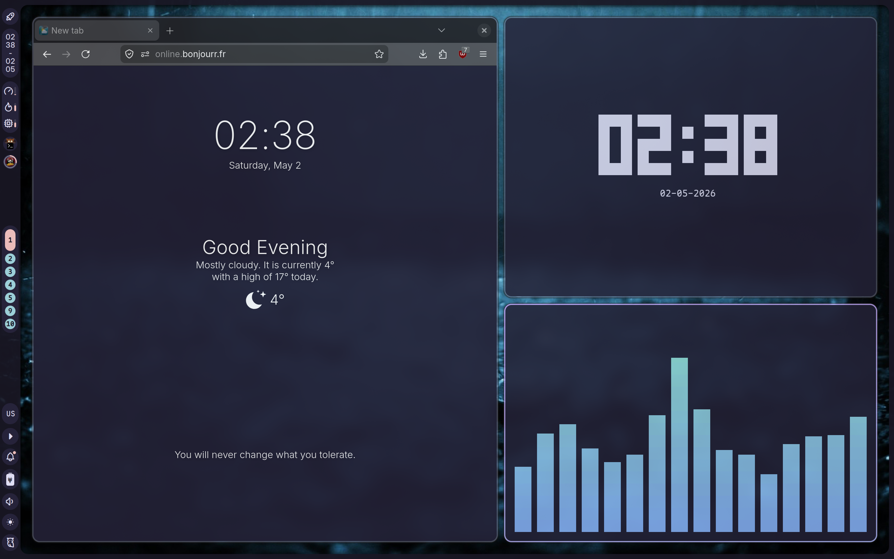

<div align="center">

# 🌙 NixOS Configuration

</div>

<p align="center">
<a href="https://nixos.org/"></a>
</p>

---

## ✨ Features

- **Window Manager** • [Hyprland](https://github.com/hyprwm/Hyprland) 🎨
- **Shell** • [Zsh](https://www.zsh.org) 🐚
- **Terminal** • [Kitty](https://sw.kovidgoyal.net/kitty/) 💻
- **Panel** • [Noctalia Shell](https://github.com/noctalia-dev/noctalia-shell) 🍧
- **Browser** • [LibreWolf](https://librewolf.net/) 🦊
- **Editor** • [VSCodium](https://vscodium.com/) 📝
- **Notes** • [Obsidian](https://obsidian.md/) 📚
- **Music** • [ncmpcpp](https://github.com/ncmpcpp/ncmpcpp) + [Cava](https://github.com/karlstav/cava) 🎵
- **Screenshots** • [grimblast](https://github.com/hyprwm/contrib) 📸
- **Sync** • [Syncthing](https://syncthing.net/) 🔄
- **Theme** • Catppuccin 🎨

---

## 📁 Structure

```
nixos-config/
├── flake.nix                 # Flake configuration
├── configuration.nix         # System configuration
├── hardware-configuration.nix
└── home/                     # Home-manager modules
    ├── home.nix             # Main home configuration
    ├── hyprland.nix         # Hyprland WM config
    ├── kitty.nix            # Terminal config
    ├── zsh.nix              # Shell config
    ├── librewolf.nix        # Browser config
    ├── vscodium.nix         # Editor config
    ├── obsidian.nix         # Notes app config
    ├── ncmpcpp.nix          # Music player config
    ├── cava.nix             # Audio visualizer config
    ├── noctalia.nix         # Shell/panel config
    ├── syncthing.nix        # File sync config
    └── theming.nix          # Theme configuration
```

---

## 🚀 Installation

1. Clone this repository:

```bash
git clone https://github.com/dnvery/nixos-config ~/.config/nixos
```

2. Update `hardware-configuration.nix` with your system's hardware config:

```bash
nixos-generate-config --show-hardware-config > ~/.config/nixos/hardware-configuration.nix
```

3. Update the hostname in `flake.nix` if needed (currently set to `nixos`)

4. Build and switch to the configuration:

```bash
sudo nixos-rebuild switch --flake ~/.config/nixos#nixos
```

---

## 🎨 Screenshots



---

## ⌨️ Key Bindings

### Hyprland

- `SUPER + Q` - Launch terminal (Kitty)
- `SUPER + C` - Close active window
- `SUPER + M` - Exit Hyprland
- `SUPER + V` - Toggle floating
- `SUPER + R` - Launch Noctalia launcher
- `Print` - Screenshot area (copy + save)
- `SHIFT + Print` - Screenshot area (save only)
- `CTRL + Print` - Screenshot full screen (copy + save)

---

## 📝 Notes

- This configuration uses NixOS unstable channel
- Home-manager is integrated via flake
- Screenshots are saved with timestamp format: `screenshot-YYYYMMDD-HHMMSS.png`
